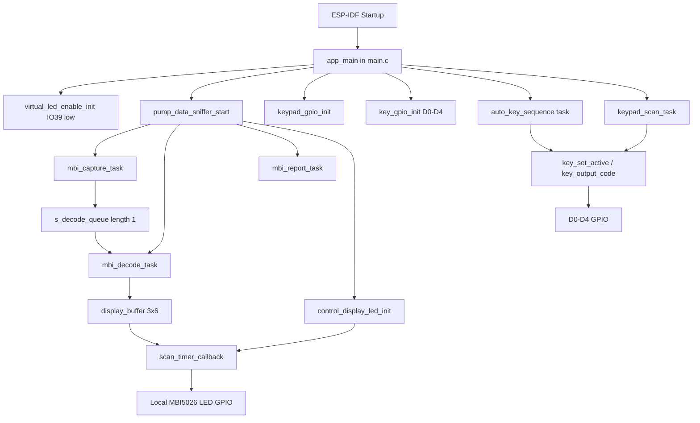
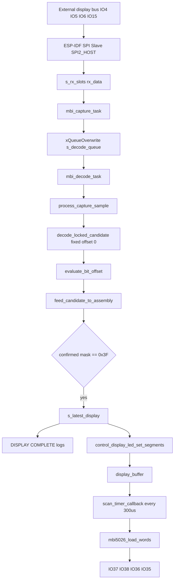

# Firmware Architecture

## 1. Project Overview

Project `KEYBOARD_PHUONG_NAM` là firmware ESP-IDF cho ESP32-S3. Theo source hiện tại, firmware thực hiện ba nhóm chức năng chính:

- Đọc keypad ma trận 5x5 từ GPIO và map nút vật lý sang mã phím ảo.
- Xuất mã phím ảo ra 5 đường GPIO `D0..D4`.
- Sniffer dữ liệu SPI/MBI5026 từ mạch ngoài để giải mã dữ liệu LED 7 đoạn 3 hàng x 6 cột, đồng thời xuất lại dữ liệu này ra LED 7 đoạn qua driver MBI5026 nội bộ.

Platform thực tế từ `sdkconfig`:

- MCU target: `esp32s3`
- ESP-IDF project dùng CMake
- RTOS: FreeRTOS từ ESP-IDF
- CPU architecture: Xtensa
- Flash size: `2MB`
- FreeRTOS multicore: `CONFIG_FREERTOS_UNICORE` không bật
- Log default level: `INFO`

Các chức năng chính trong firmware:

- `app_main()` khởi tạo GPIO quyền điều khiển LED, sniffer, keypad, output phím ảo, auto key sequence.
- `pump_data_sniffer_start()` tạo các task capture/decode/report cho luồng sniffer.
- `control_display_led_init()` khởi tạo driver LED 7 đoạn MBI5026 và timer scan.
- `keypad_scan_task()` scan keypad 5x5.
- `auto_key_sequence_task()` tự xuất chuỗi phím cấu hình sẵn.

## 2. Firmware Architecture

Kiến trúc hiện tại chia theo module:

- Application layer: `main/main.c`
- Pump data sniffer / processing layer: `main/pump_data_sniffer.c`
- LED driver layer: `main/control_display_led.c`
- Build configuration: `CMakeLists.txt`, `main/CMakeLists.txt`, `sdkconfig`

Application layer trong `main.c` điều phối startup. Nó gọi `pump_data_sniffer_start()` để module sniffer tự tạo RTOS task, gọi `keypad_gpio_init()` để chuẩn bị keypad, gọi `key_gpio_init()` để chuẩn bị D0-D4, và gọi `auto_key_sequence_start()` nếu `ENABLE_AUTO_KEY_SEQUENCE = 1`.

Sniffer layer dùng SPI slave để capture dữ liệu từ mạch ngoài qua `IO4/IO5/IO6/IO15`. Dữ liệu capture được đưa qua FreeRTOS queue tới decode task. Decode task giải mã frame MBI5026 thành buffer LED 3x6, cập nhật dữ liệu dùng chung và gọi `control_display_led_set_segments()`.

LED driver layer dùng `esp_timer` periodic callback để scan LED 7 đoạn qua MBI5026 bằng GPIO `IO37/IO38/IO36/IO35`.

## 3. Entry Point and Startup Flow

Startup flow theo source hiện tại:

1. ESP-IDF startup gọi `app_main()` trong `main/main.c`.
2. `app_main()` gọi `virtual_led_enable_init()`.
3. Nếu `ENABLE_PUMP_DATA_SNIFFER = 1`, gọi `pump_data_sniffer_start()` trong `main/pump_data_sniffer.c`.
4. `pump_data_sniffer_start()` gọi `reset_display_assembly()`.
5. `pump_data_sniffer_start()` gọi `control_display_led_init()` trong `main/control_display_led.c`.
6. `control_display_led_init()` gọi `display_gpio_init()`, `display_clear()`, `esp_timer_create()`, `esp_timer_start_periodic()`.
7. `pump_data_sniffer_start()` tạo `s_decode_queue`.
8. `pump_data_sniffer_start()` tạo task `mbi_capture_task` pinned core 0.
9. `pump_data_sniffer_start()` tạo task `mbi_decode_task` pinned core 1 nếu không unicore.
10. `pump_data_sniffer_start()` tạo task `mbi_report_task` pinned core 1 nếu không unicore.
11. `app_main()` gọi `keypad_gpio_init()` nếu `ENABLE_KEYPAD = 1`.
12. Nếu `COMBINES_KEYPAD_FUNTIONS = 1`, `app_main()` gọi `key_gpio_init()`, `key_release()`.
13. Nếu `ENABLE_AUTO_KEY_SEQUENCE = 1`, `app_main()` gọi `auto_key_sequence_start()`.
14. `auto_key_sequence_start()` tạo task `auto_key_sequence`.
15. `app_main()` tạo task `keypad_scan_task`.
16. `app_main()` return; các RTOS task và esp_timer tiếp tục chạy.

## 4. File / Module Responsibility

| File/Module | Responsibility | Important Functions | Dependencies |
|---|---|---|---|
| `main/main.c` | Application startup, virtual key output, keypad scan, auto key sequence, virtual LED enable GPIO | `app_main`, `virtual_led_enable_init`, `key_gpio_init`, `key_set_active`, `key_press`, `auto_key_sequence_task`, `keypad_scan_task` | FreeRTOS task, GPIO driver, ESP log/error, `pump_data_sniffer.h` |
| `main/pump_data_sniffer.c` | Capture SPI data from external MBI-like signal, decode LED 7-segment data, report/log display state, forward decoded display to LED driver | `pump_data_sniffer_start`, `mbi_capture_task`, `mbi_decode_task`, `process_capture_sample`, `evaluate_bit_offset`, `feed_candidate_to_assembly`, `mbi_report_task`, `mbi_sniffer_get_display` | FreeRTOS task/queue, GPIO, SPI slave, esp_timer, `control_display_led_set_segments` |
| `main/pump_data_sniffer.h` | Public interface for sniffer module | `pump_data_sniffer_start`, `mbi_sniffer_get_display` | `stdbool.h`, `stdint.h` |
| `main/control_display_led.c` | Drive local 18 LED 7-segment display through MBI5026-style shift/latch/OE GPIO | `control_display_led_init`, `control_display_led_set_segments`, `control_display_led_clear`, `scan_timer_callback`, `mbi5026_load_words` | GPIO, esp_timer, esp_rom_sys delay, FreeRTOS critical sections |
| `main/CMakeLists.txt` | Registers main component source files | `idf_component_register` | ESP-IDF build system |
| `CMakeLists.txt` | Root ESP-IDF project definition | `project(KEYBOARD_PHUONG_NAM)` | ESP-IDF CMake project |
| `sdkconfig` | Generated ESP-IDF configuration | target/log/build config | ESP-IDF |
| `pytest_hello_world.py` | Generic pytest example file from template | `test_hello_world` | pytest, pytest_embedded |

## 5. Task Architecture

| Task name | Source file | Priority | Stack size | Core | Cycle / Blocking | Responsibility | Input | Output / Shared data |
|---|---:|---:|---:|---:|---|---|---|---|
| `mbi_capture_task` | `pump_data_sniffer.c` | 8 | 4096 | 0 | Blocks on `spi_slave_get_trans_result(portMAX_DELAY)` | Capture SPI transactions from external logic | SPI slave on `SPI2_HOST`, MOSI `IO6`, SCLK `IO15`, CS `IO5`, OE input `IO4` | Writes `s_spi_rx_count`, overwrites `s_decode_queue` with `mbi_capture_sample_t` |
| `mbi_decode_task` | `pump_data_sniffer.c` | 5 | 6144 | 1 if multicore, 0 if unicore | Blocks on `xQueueReceive(portMAX_DELAY)` | Decode latest captured sample and update display state | `s_decode_queue` | Updates shared decode counters/display state, calls `control_display_led_set_segments()` |
| `mbi_report_task` | `pump_data_sniffer.c` | 2 | 6144 | 1 if multicore, 0 if unicore | `REPORT_PERIOD_MS = 500` ms | Print periodic stats and new complete display logs | Shared sniffer state protected by `s_shared_lock` | ESP log |
| `keypad_scan_task` | `main.c` | 5 | 4096 | Not pinned | `KEYPAD_SCAN_PERIOD_MS = 20` ms; per row delay `KEYPAD_SCAN_DELAY_MS = 1` ms | Scan 5x5 keypad and optionally drive virtual key output | ROW GPIO output, COL GPIO input | ESP log, calls `key_set_active()` if combined mode enabled |
| `auto_key_sequence` | `main.c` | 4 | 4096 | Not pinned | Hold/delay/repeat from defines | Automatically emits configured virtual key sequence | `AUTO_KEY_SEQUENCE` | Calls `key_press()` to drive D0-D4 |

Timer callback:

| Timer/callback | Source file | Period | Dispatch | Responsibility |
|---|---|---:|---|---|
| `led7seg_scan` / `scan_timer_callback` | `control_display_led.c` | `SCAN_PERIOD_US = 300` us because `SAFE_ONE_DIGIT_SCAN = 0` | `ESP_TIMER_TASK` | Scan 6 display columns, shift U2 then U1 data to MBI5026, enable OE |

Queue/Synchronization:

- `s_decode_queue`: FreeRTOS queue length 1, stores latest `mbi_capture_sample_t`; producer `mbi_capture_task`, consumer `mbi_decode_task`.
- `s_shared_lock`: `portMUX_TYPE`, protects shared sniffer reporting/display state.
- `display_lock`: `portMUX_TYPE`, protects `display_buffer` between API writes and LED scan callback.

## 6. Main Runtime Flow

Keypad to virtual key flow:

```text
keypad_scan_task
-> keypad_scan_matrix
-> keypad_log_changed_keys
-> keypad_get_first_key
-> key_set_active
-> key_output_code
-> GPIO D0..D4
```

Auto key sequence flow:

```text
auto_key_sequence_task
-> key_code_from_char
-> key_press
-> key_set_active
-> key_output_code
-> GPIO D0..D4
```

External display data sniffer flow:

```text
External IO4/IO5/IO6/IO15
-> ESP-IDF SPI slave
-> mbi_capture_task
-> s_decode_queue
-> mbi_decode_task
-> process_capture_sample
-> decode_locked_candidate
-> evaluate_bit_offset
-> feed_candidate_to_assembly
-> control_display_led_set_segments
-> display_buffer
-> scan_timer_callback
-> MBI5026 output GPIO
```

## 7. Data Flow

### Virtual Key Output

- Source: physical keypad matrix or `AUTO_KEY_SEQUENCE`.
- Parser: `key_code_from_char()` for auto sequence; `keypad_key_map` for keypad.
- Processing: `key_press()` or `key_set_active()`.
- Output: GPIO `PIN_D0..PIN_D4`.
- Format: 5-bit binary key code, D0 least significant bit.

Important key codes:

- `KEY_1..KEY_9`, `KEY_0`
- `KEY_HASH`, `KEY_DOLLAR`
- `KEY_F1..KEY_F6`
- `KEY_C`, `KEY_E`, `KEY_L`, `KEY_P`, `KEY_T`, `KEY_V`
- `KEY_NONE = 0`

### Keypad Matrix

- Source: ROW output pins and COL input pins.
- ROW pins: `IO19`, `IO20`, `IO46`, `IO9`, `IO10`.
- COL pins: `IO21`, `IO14`, `IO13`, `IO12`, `IO11`.
- Buffer: `pressed_mask` local in `keypad_scan_matrix()`.
- Processing: stable mask comparison in `keypad_scan_task()`.
- Use: logging and optional virtual key output.

### Pump Data Sniffer

- Source: SPI-like MBI5026 external signals.
- Pins:
  - `OE_IN_GPIO = IO4`
  - `LE_IN_GPIO = IO5`
  - `SDI_IN_GPIO = IO6`
  - `CLK_IN_GPIO = IO15`
- Buffer: `s_rx_slots[RX_SLOT_COUNT]`, each slot has `rx_data[64]`.
- Sample struct: `mbi_capture_sample_t`.
- Parser: `read_circular_u16()`, `evaluate_bit_offset()`.
- Processing: `decode_locked_candidate()`, `feed_candidate_to_assembly()`.
- Stored state: `s_latest_candidate`, `s_latest_display`, assembly arrays.
- Consumer: report task and `control_display_led_set_segments()`.

Important structs:

- `mbi_rx_slot_t`: SPI transaction slot and RX buffer.
- `mbi_capture_sample_t`: copied SPI transaction data plus bit count and OE level.
- `mbi_decode_result_t`: decoded U1/U2 per column and display segment matrix.

### Local LED Driver

- Source: `control_display_led_set_segments()`.
- Buffer: `display_buffer[3][6]`.
- Processing: `scan_timer_callback()` builds `u1_word` and `u2_word`.
- Output: MBI5026 GPIO `IO37`, `IO38`, `IO36`, `IO35`.

## 8. Communication Flow

### SPI Slave Capture

Hardware:

```text
External MBI-like bus
-> IO6 SDI_IN_GPIO as MOSI
-> IO15 CLK_IN_GPIO as SCLK
-> IO5 LE_IN_GPIO as SPI CS
-> IO4 OE_IN_GPIO sampled in post transaction callback
```

Driver:

- `spi_slave_initialize(MBI_SPI_HOST, ..., SPI_DMA_DISABLED)`
- `SPI_CAPTURE_MODE = 1`
- `MAX_CAPTURE_BITS = 512`, expected transaction length `EXPECTED_CAPTURE_BITS = 192`
- Queue size `RX_SLOT_COUNT = 16`

Callback:

- `spi_post_transaction_callback()` reads `OE_IN_GPIO` into `slot->oe_at_end`.

Buffer/parser/application:

```text
spi_slave_get_trans_result
-> mbi_capture_sample_t
-> xQueueOverwrite(s_decode_queue)
-> process_capture_sample
```

### GPIO Output to Virtual Key Interface

- Output pins: `IO16`, `IO8`, `IO18`, `IO17`, `IO7`.
- `key_output_code()` writes each bit of key code to D0-D4.
- `key_release()` outputs `KEY_NONE = 0`.

### GPIO Keypad Scan

- Output rows: `IO19`, `IO20`, `IO46`, `IO9`, `IO10`.
- Input columns with pulldown: `IO21`, `IO14`, `IO13`, `IO12`, `IO11`.
- Scan method: set all rows low, drive one row high, wait 1 ms, read columns.

### GPIO MBI5026 LED Output

- `PIN_SDI = IO37`
- `PIN_OE = IO38`
- `PIN_CLK = IO36`
- `PIN_LE = IO35`
- `mbi5026_shift_word_msb()` clocks 16 bits MSB first.
- `mbi5026_load_words()` sends U2 word first, then U1 word.

Other interfaces:

- UART: no application UART logic found.
- I2C: no application I2C logic found.
- CAN: no application CAN logic found.
- Ethernet/MQTT/TCP/Modbus/USB/BLE: no application protocol logic found.

## 9. Interrupt Flow

No explicit GPIO ISR is configured in application code. GPIO configs use `GPIO_INTR_DISABLE`.

Important callback/interrupt-like flows:

| Source | Callback | Data processed | Modified data | Consumer |
|---|---|---|---|---|
| SPI slave transaction completion | `spi_post_transaction_callback()` | `spi_slave_transaction_t *transaction`, OE GPIO level | `mbi_rx_slot_t.oe_at_end` | `mbi_capture_task` copies into `mbi_capture_sample_t` |
| ESP timer periodic event | `scan_timer_callback()` | `display_buffer` | MBI5026 GPIO output state | Physical/local LED display |

Shared data between callback/task:

- `display_buffer` is written by `control_display_led_set_segments()` and read by `scan_timer_callback()`, protected by `display_lock`.
- `slot->oe_at_end` is written in SPI post transaction callback and read in capture task after transaction completion.

## 10. State Machines

No formal enum-based state machine was found.

Implicit state machines:

### Keypad Debounce / Stable Mask

File: `main.c`

States are implicit:

```text
last_sample_mask
-> stable_mask
-> changed key event
```

Transition condition:

- If `sample_mask == last_sample_mask` and differs from `stable_mask`, new stable state is accepted.

Action:

- Log key changes.
- If `COMBINES_KEYPAD_FUNTIONS = 1`, set active virtual key from first pressed key.

### Sniffer Assembly

File: `pump_data_sniffer.c`

States are implicit:

```text
No assembly
-> Partial columns confirmed
-> 0x3F complete display
-> Display changed
```

Transition condition:

- Per-column confidence reaches `COLUMN_CONFIRM_COUNT` or `BLANK_COLUMN_CONFIRM_COUNT`.
- Complete state when `s_assembly_confirmed_mask == 0x3F`.

Action:

- Build complete display and update `s_latest_display`.
- Call `control_display_led_set_segments()`.
- Print `DISPLAY COMPLETE` logs when display changes.

### Sniffer Offset Selection

File: `pump_data_sniffer.c`

Current behavior:

- `USE_FIXED_BIT_OFFSET = 1`
- `FIXED_BIT_OFFSET = 0`

Implicit state:

```text
INVALID_ASSEMBLY_OFFSET
-> fixed offset 0
```

When fixed offset is first applied, `decode_locked_candidate()` logs `Dung offset bat data co dinh: 0`.

## 11. Global Data and Important Structures

### `main.c`

- `key_pins[]`: GPIO list for D0-D4 virtual key output.
- `keypad_rows[]`: GPIO list for keypad rows.
- `keypad_cols[]`: GPIO list for keypad columns.
- `keypad_key_map[5][5]`: mapping from ROW/COL to key code.
- `current_key` static inside `key_set_active()`: remembers last virtual key state to avoid repeated output/log.

### `pump_data_sniffer.c`

- `s_rx_slots[16]`: SPI slave transaction buffers.
- `s_decode_queue`: queue length 1 carrying latest `mbi_capture_sample_t`.
- `s_spi_rx_count`: atomic-ish volatile counter updated by capture task.
- `s_decoded_sample_count`, `s_capture_192_count`, `s_capture_other_count`, `s_valid_block_total`, `s_display_complete_count`, `s_assembly_timeout_count`: report counters.
- `s_latest_candidate`: latest decoded candidate.
- `s_latest_display`: latest complete display.
- `s_assembly_u1[6]`, `s_assembly_u2[6]`: per-column pending/confirmed raw words.
- `s_assembly_confidence[6]`: per-column confidence.
- `s_assembly_confirmed_mask`: bitmask of confirmed columns.
- `s_assembly_bit_offset`: bit offset used by current assembly.
- `s_locked_bit_offset`: fixed/locked decode offset.
- `s_live_display[3][6]`, `s_live_blank_confidence[6]`: live display update cache.
- `s_shared_lock`: protects shared report/display variables.

### `control_display_led.c`

- `display_buffer[3][6]`: segment buffer for 18 LED positions.
- `display_lock`: protects display buffer.
- `scan_timer_handle`: ESP timer handle for periodic LED scan.

## 12. Initialization Order

Current initialization order in `app_main()` with current defines:

```text
virtual_led_enable_init
-> pump_data_sniffer_start
   -> reset_display_assembly
   -> control_display_led_init
      -> display_gpio_init
      -> display_clear
      -> esp_timer_create
      -> esp_timer_start_periodic
   -> xQueueCreate(s_decode_queue)
   -> xTaskCreatePinnedToCore(mbi_capture_task)
   -> xTaskCreatePinnedToCore(mbi_decode_task)
   -> xTaskCreatePinnedToCore(mbi_report_task)
-> keypad_gpio_init
-> key_gpio_init
-> key_release
-> auto_key_sequence_start
-> xTaskCreate(keypad_scan_task)
```

Dependency notes:

- `control_display_led_init()` must run before sniffer decoded data can be mirrored to local LED driver.
- `s_decode_queue` must exist before capture task starts producing samples.
- `key_gpio_init()` must run before `auto_key_sequence_task()` or keypad combined mode drives D0-D4.
- `virtual_led_enable_init()` sets IO39 low before other runtime logic.

## 13. Configuration

Only values visible in source/config are listed.

### Main Feature Defines

| Define | Value | Meaning |
|---|---:|---|
| `ENABLE_KEYPAD` | `1` | Build/run keypad scan path |
| `COMBINES_KEYPAD_FUNTIONS` | `1` | Physical keypad drives virtual key output |
| `ENABLE_PUMP_DATA_SNIFFER` | `1` | Start pump data sniffer module |
| `ENABLE_AUTO_KEY_SEQUENCE` | `1` | Start automatic key sequence task |
| `AUTO_KEY_SEQUENCE` | `"#122973E2522EC"` | Current auto key sequence |
| `AUTO_KEY_HOLD_TIME_MS` | `50` | Hold time per auto key press |
| `AUTO_KEY_DELAY_BETWEEN_MS` | `50` | Delay between auto key presses |
| `AUTO_KEY_REPEAT_DELAY_MS` | `2000` | Delay between full sequence repeats |

### Virtual Key Output GPIO

| Signal | GPIO |
|---|---:|
| `PIN_D0` | `IO16` |
| `PIN_D1` | `IO8` |
| `PIN_D2` | `IO18` |
| `PIN_D3` | `IO17` |
| `PIN_D4` | `IO7` |

### Keypad GPIO

| Signal | GPIO |
|---|---:|
| `ROW_1_GPIO` | `IO19` |
| `ROW_2_GPIO` | `IO20` |
| `ROW_3_GPIO` | `IO46` |
| `ROW_4_GPIO` | `IO9` |
| `ROW_5_GPIO` | `IO10` |
| `COL_1_GPIO` | `IO21` |
| `COL_2_GPIO` | `IO14` |
| `COL_3_GPIO` | `IO13` |
| `COL_4_GPIO` | `IO12` |
| `COL_5_GPIO` | `IO11` |

### Sniffer Configuration

| Define | Value |
|---|---:|
| `OE_IN_GPIO` | `IO4` |
| `LE_IN_GPIO` | `IO5` |
| `SDI_IN_GPIO` | `IO6` |
| `CLK_IN_GPIO` | `IO15` |
| `MBI_SPI_HOST` | `SPI2_HOST` |
| `SPI_CAPTURE_MODE` | `1` |
| `MAX_CAPTURE_BYTES` | `64` |
| `MAX_CAPTURE_BITS` | `512` |
| `EXPECTED_CAPTURE_BITS` | `192` |
| `FRAME_BITS` | `32` |
| `FRAME_COUNT` | `6` |
| `RX_SLOT_COUNT` | `16` |
| `COLUMN_CONFIRM_COUNT` | `2` |
| `BLANK_COLUMN_CONFIRM_COUNT` | `2` |
| `LIVE_BLANK_CONFIRM_COUNT` | `2` |
| `ENABLE_BLANK_COLUMN1_FALLBACK` | `1` |
| `BLANK_COLUMN1_TIMEOUT_US` | `1000000` |
| `FILTER_COLUMN1_ROW2_ROW3_GHOST` | `1` |
| `USE_FIXED_BIT_OFFSET` | `1` |
| `FIXED_BIT_OFFSET` | `0` |
| `REPORT_PERIOD_MS` | `500` |

### Local LED Driver Configuration

| Define | Value |
|---|---:|
| `PIN_SDI` | `IO37` |
| `PIN_OE` | `IO38` |
| `PIN_CLK` | `IO36` |
| `PIN_LE` | `IO35` |
| `DISPLAY_ROWS` | `3` |
| `DISPLAY_COLUMNS` | `6` |
| `SAFE_ONE_DIGIT_SCAN` | `0` |
| `SCAN_PERIOD_US` | `300` |
| `MBI_SHIFT_DELAY_US` | `0` |

### ESP-IDF Configuration

| Config | Value |
|---|---|
| `CONFIG_IDF_TARGET` | `esp32s3` |
| `CONFIG_IDF_TARGET_ARCH` | `xtensa` |
| `CONFIG_ESPTOOLPY_FLASHSIZE` | `2MB` |
| `CONFIG_PARTITION_TABLE_FILENAME` | `partitions_singleapp.csv` |
| `CONFIG_ESP_DEFAULT_CPU_FREQ_MHZ` | `160` |
| `CONFIG_LOG_DEFAULT_LEVEL` | `3` / INFO |

## 14. Error Handling

Current error handling:

- ESP-IDF calls are commonly wrapped with `ESP_ERROR_CHECK()`. On error, ESP-IDF abort behavior applies.
- `xQueueCreate()` failure logs `Khong tao duoc decode queue` and calls `ESP_ERROR_CHECK(ESP_ERR_NO_MEM)`.
- Task creation failure calls `ESP_ERROR_CHECK(ESP_ERR_NO_MEM)`.
- `spi_slave_get_trans_result()` failure logs error name and continues after `taskYIELD()`.
- Invalid auto sequence characters log warning and are skipped.
- Invalid virtual key code logs error and releases key output.

Timeout/retry:

- SPI capture waits indefinitely on `spi_slave_get_trans_result(portMAX_DELAY)`.
- Decode queue receive waits indefinitely on `xQueueReceive(portMAX_DELAY)`.
- `BLANK_COLUMN1_TIMEOUT_US = 1000000` is used to infer column 1 blank when columns 2-6 are confirmed and column 1 is missing.
- No network reconnect, MQTT retry, watchdog-specific logic, or persistent error recovery was found.

## 15. Current Firmware Behavior

### CURRENT BEHAVIOR

- On startup, IO39 is configured output and set to `0`, logged as external LED control mode.
- Sniffer starts when `ENABLE_PUMP_DATA_SNIFFER = 1`.
- Sniffer captures 192-bit SPI transactions from external bus using SPI slave mode 1.
- Decode uses fixed bit offset `0`.
- Decoder rejects segment byte `0xFF`.
- Decoder interprets U2 OUT10..OUT15 as column control bits.
- Decoder interprets U1 low byte as row 1 segment, U1 high byte as row 2 segment, U2 low byte as row 3 segment.
- Complete display requires `s_assembly_confirmed_mask == 0x3F`.
- Complete display changes are logged immediately in `process_capture_sample()` and can also be reported by `mbi_report_task`.
- Decoded display is sent to `control_display_led_set_segments()`.
- Local LED driver scans 6 columns at `300us` per column and drives all three rows for that column together.
- Keypad scans every 20 ms.
- Auto key sequence `#122973E2522EC` runs repeatedly when enabled.
- If both keypad combined mode and auto sequence are enabled, both can call `key_set_active()` / `key_press()` and drive D0-D4.

### POTENTIAL ISSUE / DESIGN CONCERN

- `COMBINES_KEYPAD_FUNTIONS` is misspelled; current code uses that exact name.
- `AUTO_KEY_SEQUENCE` in source is `#122973E2522EC`; earlier requested examples may differ. Current behavior follows source.
- Auto key sequence and keypad combined output share `key_set_active()` without a mutex. Concurrent physical key activity can interact with the auto sequence.
- `s_decode_queue` length is 1 and uses `xQueueOverwrite()`, so decode task only processes the latest captured sample. This reduces backlog but can drop intermediate samples.
- `USE_FIXED_BIT_OFFSET = 1` assumes offset 0 is always correct.
- `SPI_CAPTURE_MODE` comment says mode 0 was previously near correct, but current define is `1`.
- `control_display_led.c` comment says LE pin was not provided and uses GPIO35. Current source uses `PIN_LE = GPIO_NUM_35`.
- `s_assembly_timeout_count` exists but no clear increment path was observed in the read sections; behavior appears unused or incomplete.
- GPIO overlap should be checked against PCB: virtual key output uses `IO18/IO17`, keypad uses `IO19/IO20/IO46/IO9/IO10`, LED enable uses `IO39`, LED driver uses `IO35..IO38`, sniffer uses `IO4/IO5/IO6/IO15`.

## 16. Important Dependencies

`main.c` depends on:

- ESP-IDF GPIO driver
- FreeRTOS task API
- ESP log/error
- `pump_data_sniffer.h`

`pump_data_sniffer.c` depends on:

- SPI slave driver
- GPIO driver
- FreeRTOS task and queue
- ESP timer
- `control_display_led_init()`
- `control_display_led_set_segments()`

`control_display_led.c` depends on:

- GPIO driver
- ESP timer
- ESP ROM delay
- FreeRTOS critical section primitives

Runtime dependency chain:

```text
app_main
-> pump_data_sniffer_start
-> control_display_led_init
-> control_display_led_set_segments
-> scan_timer_callback
```

## 17. Rewrite Requirements

### Requirements to reproduce current firmware

To rewrite the firmware while keeping current behavior:

- Target ESP32-S3 under ESP-IDF/FreeRTOS.
- Preserve virtual key code mapping and D0-D4 bit order:
  - D0 is bit 0, D4 is bit 4.
  - Key codes `1..24` must map to the same symbols in `key_get_name()`.
- Preserve virtual key output GPIO:
  - `D0=IO16`, `D1=IO8`, `D2=IO18`, `D3=IO17`, `D4=IO7`.
- Preserve IO39 startup behavior:
  - Configure `ENABLE_VIRTUAL_LED_GPIO = IO39` as output.
  - Set level `0` at startup.
- Preserve keypad matrix scan:
  - Rows driven high one at a time.
  - Columns read as input with pulldown.
  - Stable event requires two identical consecutive masks.
- Preserve keypad key map:
  - Row 1: `#`, `P`, `7`, `8`, `9`
  - Row 2: `E`, `V`, `4`, `5`, `6`
  - Row 3: `C`, `T`, `1`, `2`, `3`
  - Row 4: `F4`, `F5`, `F6`, `$`, `0`
  - Row 5: `F1`, `F2`, `F3`, `L`, `NONE`
- Preserve auto sequence behavior:
  - Repeated string sequence from `AUTO_KEY_SEQUENCE`.
  - Hold and delays from `AUTO_KEY_HOLD_TIME_MS`, `AUTO_KEY_DELAY_BETWEEN_MS`, `AUTO_KEY_REPEAT_DELAY_MS`.
- Preserve SPI sniffer pins:
  - `IO4 OE`, `IO5 LE/CS`, `IO6 SDI/MOSI`, `IO15 CLK/SCLK`.
- Preserve SPI sniffer behavior:
  - SPI slave host `SPI2_HOST`.
  - Capture mode `1`.
  - Transaction buffer 64 bytes / 512 bits.
  - Expected frame length 192 bits.
  - Six 32-bit frames per display.
  - Decode fixed bit offset 0.
  - Treat U2 first then U1 in each 32-bit frame.
  - U2 OUT10..OUT15 are column masks.
  - U1 low byte row 1, U1 high byte row 2, U2 low byte row 3.
  - Reject `0xFF` segment bytes.
  - Confirm all columns before reporting complete display.
- Preserve local MBI5026 LED driver:
  - Pins `SDI=IO37`, `OE=IO38`, `CLK=IO36`, `LE=IO35`.
  - Shift 16-bit words MSB first.
  - Send U2 word before U1 word.
  - Scan 6 columns with `SCAN_PERIOD_US = 300` because `SAFE_ONE_DIGIT_SCAN = 0`.
- Preserve report logs if compatibility with existing debug workflow matters.

## 18. Known Unclear Areas

UNCLEAR: Exact external protocol ownership.

- Source names it MBI/SPI-like display data, but there is no external protocol document in repo.

UNCLEAR: Correctness of `SPI_CAPTURE_MODE = 1`.

- Source comment mentions mode 0 was previously near correct, while current define is 1.

UNCLEAR: Whether auto key sequence should run simultaneously with keypad combined mode.

- Current code starts both when both defines are 1.

UNCLEAR: Whether `ENABLE_VIRTUAL_LED_GPIO` should ever be set to 1 by current firmware.

- Current source only initializes it to 0.

UNCLEAR: Whether `PIN_LE = IO35` is final PCB mapping.

- Comment says LE was not provided and GPIO35 is temporary; current behavior uses IO35.

UNCLEAR: Expected behavior for dropped sniffer samples.

- Queue length is 1 and overwrite is intentional in comments, but no external requirement says whether intermediate samples must be preserved.

## 19. Suggested Reading Order

1. `main/main.c`
2. `main/pump_data_sniffer.h`
3. `main/pump_data_sniffer.c`
4. `main/control_display_led.c`
5. `main/CMakeLists.txt`
6. `CMakeLists.txt`
7. `sdkconfig`
8. `README.md`

## 20. Architecture Diagram



## Runtime Data Flow Diagram



