# Firmware Runtime Flows

## 1. Boot và network

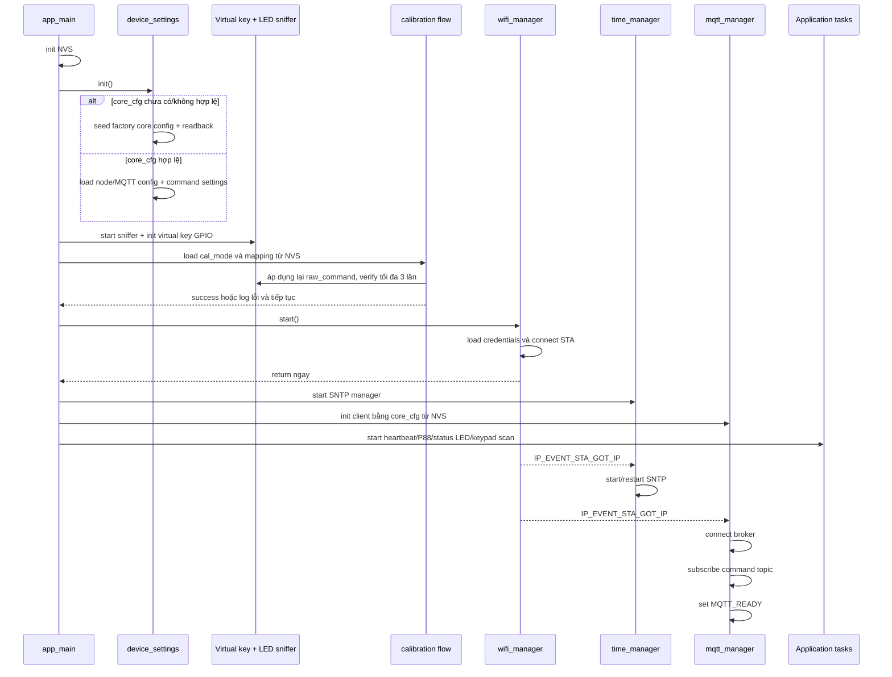

Không bước nào buộc `app_main()` chờ network. Khi Wi-Fi mất, MQTT ready bị clear; Wi-Fi và MQTT tự reconnect bằng timer/backoff.

OTA app chỉ thay nội dung `ota_0`/`ota_1`. Partition `nvs` riêng được giữ nguyên, nên boot sau OTA đi theo nhánh load cấu hình đã provision thay vì seed lại.

## 2. Sniffer LED

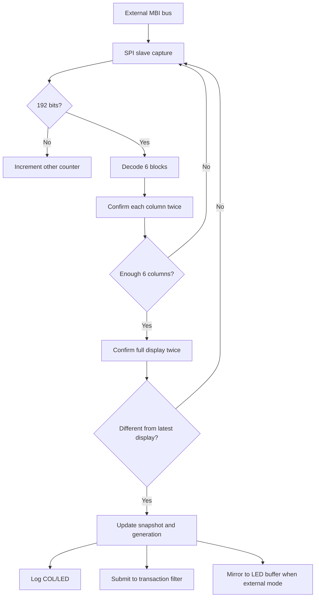

`s_display_observation_generation` tăng khi có một màn hình hoàn chỉnh được quan sát. `s_display_generation` và log chi tiết chỉ tăng/in khi nội dung đổi.

## 3. Nhận biết giao dịch bơm

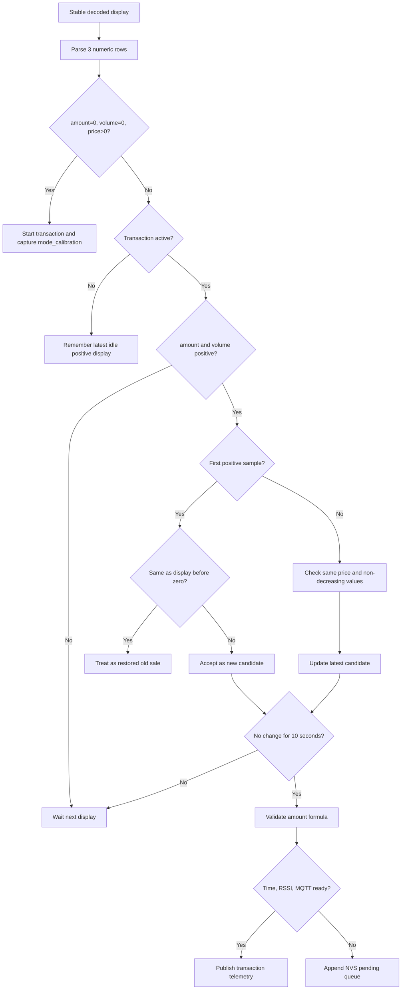

Nếu firmware bắt đầu khi màn hình đã ở `0/0`, không có màn hình cũ làm mốc, mẫu dương đầu tiên vẫn phải có thêm một bước tăng mới được coi là giao dịch.

## 4. Buffered transaction

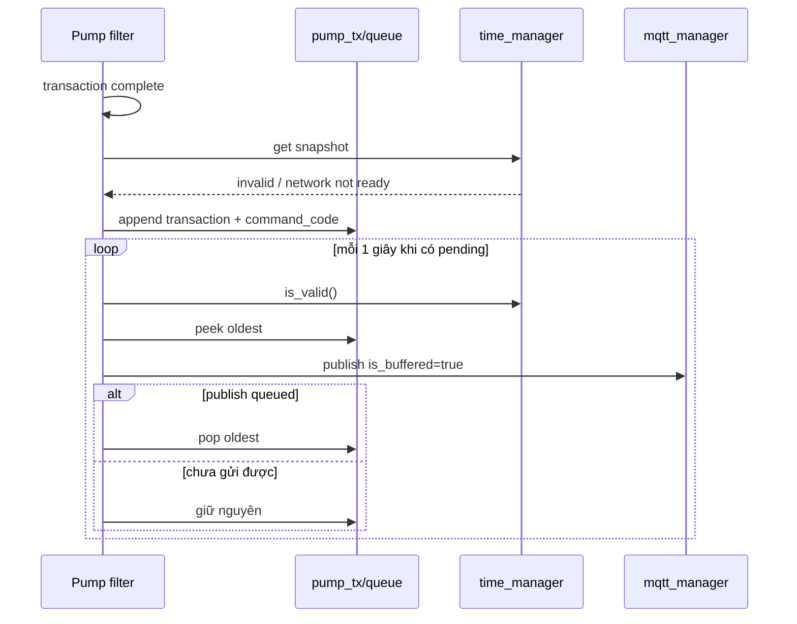

Queue FIFO tối đa 32 phần tử. Bản ghi hiện lưu tiền, lít, đơn giá và command code, chưa lưu timestamp gốc.

## 5. MQTT command

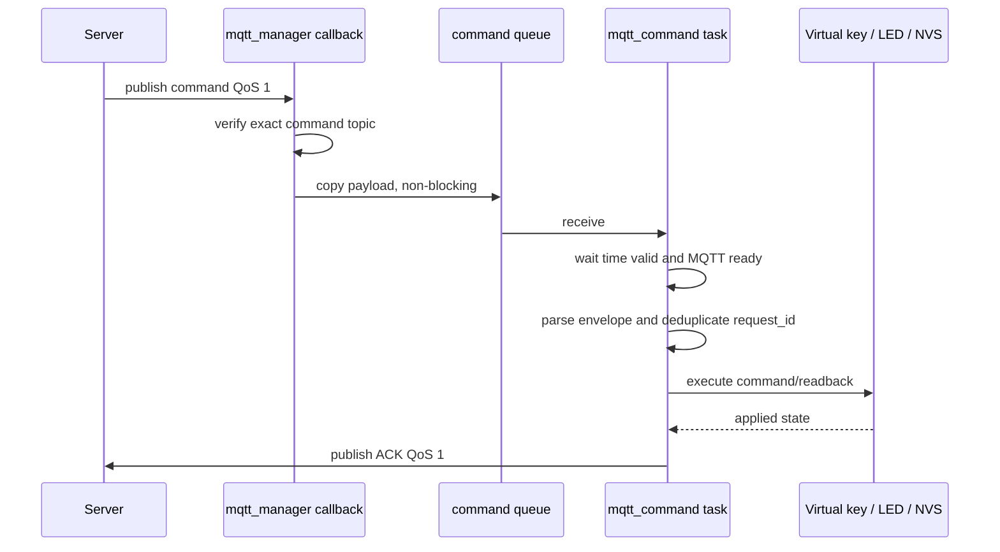

Command callback không chạy chuỗi phím. Công việc dài nằm trong command task.

## 6. Get Totalizer

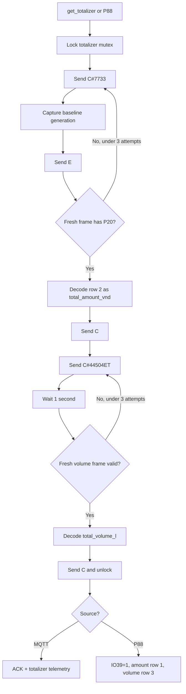

Trong P88, bất kỳ phím vật lý nào yêu cầu thoát; firmware trả IO39 về 0 và không dùng phím thoát để kích hoạt command khác.

## 7. Set unit price

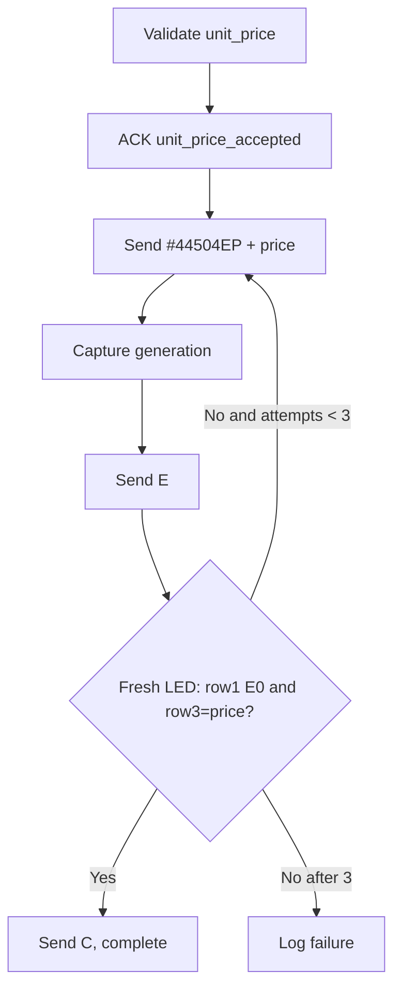

ACK hiện biểu thị command đã được tiếp nhận, chưa biểu thị thao tác cuối chắc chắn thành công.

## 8. Calibration

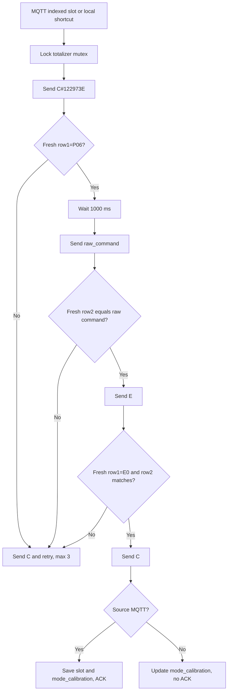

Virtual output được phân biệt với physical input nên không tự kích hoạt shortcut lặp vô hạn.

## 9. Wi-Fi Config Mode

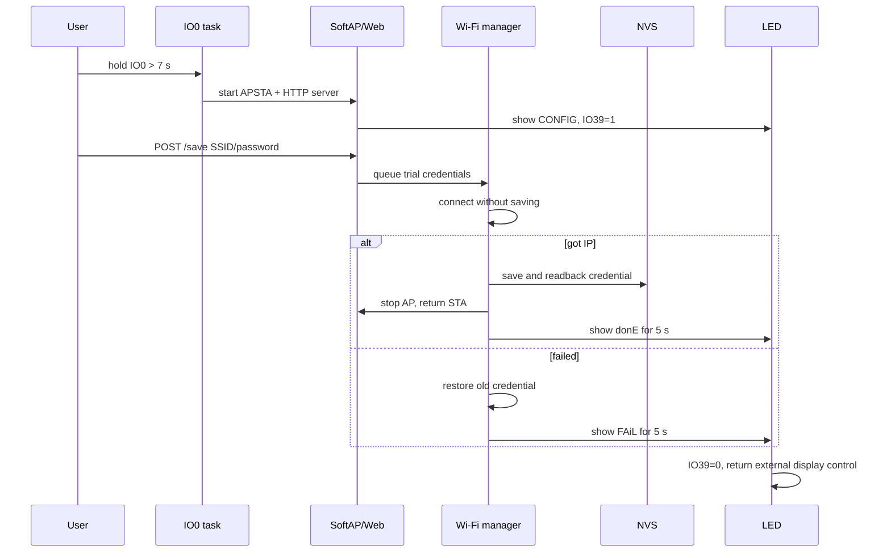

## 10. SNTP

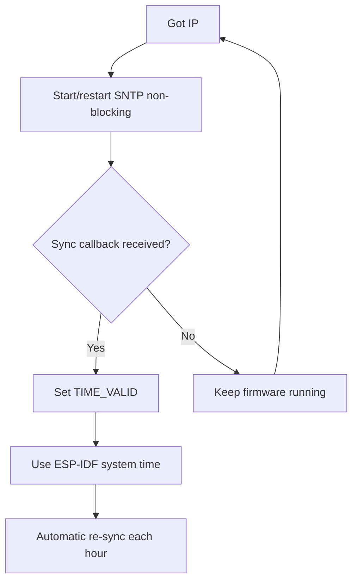

## 11. OTA

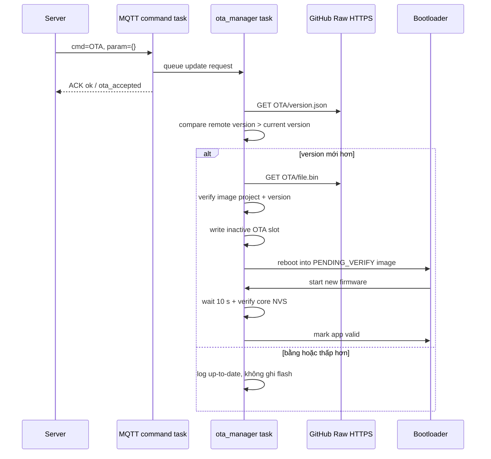

Nếu firmware mới reset/crash trước khi gọi mark-valid, bootloader chọn lại app slot hợp lệ trước đó. NVS không nằm trong app slot nên cấu hình thiết bị không bị thay bằng factory seed sau OTA.
